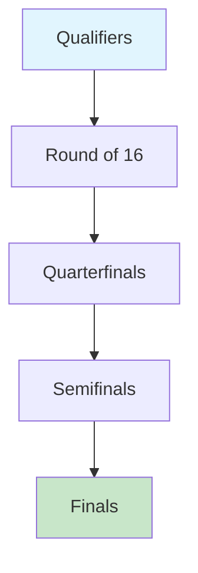

## Types of Tournaments

Gamers Oasis offers various tournament formats to suit different skill levels and preferences. You can choose from casual brackets, ranked ladders, or high-stakes cash events.

<Columns cols={3}>
  <Card title="Casual Brackets" icon="activity" href="#casual-brackets">
    Perfect for beginners. No entry fee, practice against peers.
  </Card>
  <Card title="Ranked Ladders" icon="trophy" href="#ranked-ladders">
    Climb leaderboards. Entry requires Elo rating `{>1000}`.
  </Card>
  <Card title="Cash Tournaments" icon="dollar-sign" href="#cash-tournaments">
    Compete for real money prizes. Entry fees start at `$5`.
  </Card>
</Columns>

## Entering a Competition

Follow these steps to join a tournament on the Gamers Oasis platform.

<Steps>
  <Step title="Select Tournament" icon="search">
    Navigate to the Competitions dashboard at `https://dashboard.example.com/competitions`.

    Filter by game type, format, and entry requirements.
  </Step>
  <Step title="Check Eligibility" icon="check-circle">
    Verify your account status and rating. Must be `{>=18}` years old.
  </Step>
  <Step title="Pay Entry Fee" icon="credit-card">
    Use supported payment methods. Fees are refunded for cancellations `{<24h}` before start.
  </Step>
  <Step title="Confirm Entry" icon="send">
    Receive confirmation email and join the lobby.
  </Step>
</Steps>

<Callout kind="info">
  New users get one free entry to a casual bracket tournament upon signup.
</Callout>

## API Entry for Developers

Integrate tournament entry programmatically using the Gamers Oasis API.

<Request tabs="JavaScript,cURL" show-lines="true">
  ```javascript
  const response = await fetch('https://api.example.com/v1/competitions/{competitionId}/enter', {
    method: 'POST',
    headers: {
      'Authorization': `Bearer ${YOUR_TOKEN}`,
      'Content-Type': 'application/json'
    },
    body: JSON.stringify({
      playerId: 'user123',
      paymentMethod: 'stripe'
    })
  });
  ```
  ```bash
  curl -X POST https://api.example.com/v1/competitions/{competitionId}/enter \
    -H "Authorization: Bearer YOUR_TOKEN" \
    -H "Content-Type: application/json" \
    -d '{
      "playerId": "user123",
      "paymentMethod": "stripe"
    }'
  ```
</Request>

<Response tabs="200,400">
  ```json
  {
    "success": true,
    "entryId": "entry-abc123",
    "tournament": {
      "name": "Daily Duel",
      "startTime": "2024-10-20T18:00:00Z"
    }
  }
  ```

  ```json
  {
    "error": "Invalid eligibility",
    "code": "ELIGIBILITY_FAILED"
  }
  ```
</Response>

<ParamField path="competitionId" param-type="string" required="true">
  Unique tournament identifier from the listings API.
</ParamField>

## Match Rules and Formats

Each tournament follows specific rules based on the format. Review these before entering.

<Tabs>
  <Tab title="1v1 Duel" icon="users">
    Best of 3 matches. Standard map pool. Disconnects count as losses after `{30s}` warning.
  </Tab>
  <Tab title="Team Battle" icon="users">
    5v5 format. Captain picks teams. Voice chat required. Bans: 3 per team.
  </Tab>
  <Tab title="Free-for-All" icon="activity">
    10 players, last standing wins. No teams. Power-ups enabled.
  </Tab>
</Tabs>

## Prize Distribution

Prizes scale with tournament size and entry fees. Withdraw winnings via supported methods.

| Tournament Type    | Entry Fee | 1st Place | 2nd Place | Total Pool |
|--------------------|-----------|-----------|-----------|------------|
| Casual Brackets    | Free     | Trophy   | Badge    | N/A       |
| Ranked Ladders     | Free     | 100 pts  | 50 pts   | Leaderboard |
| Cash Tournaments   | `$5-50`  | 60%      | 25%      | `$1,000+` |

<Callout kind="success">
  Winnings above `$600` require tax verification.
</Callout>

## Strategies for Success

<ExpandableGroup>
  <Expandable title="Master Fundamentals" default-open="true">
    Focus on map knowledge and basic mechanics. Practice in casual modes daily.
  </Expandable>
  <Expandable title="Analyze Opponents">
    Review replays. Note common patterns like aggressive rushes.
  </Expandable>
  <Expandable title="Team Coordination">
    Use in-game pings and voice. Assign roles: entry fragger, support.
  </Expandable>
</ExpandableGroup>



Continue refining your skills to climb the leaderboards and claim bigger prizes.