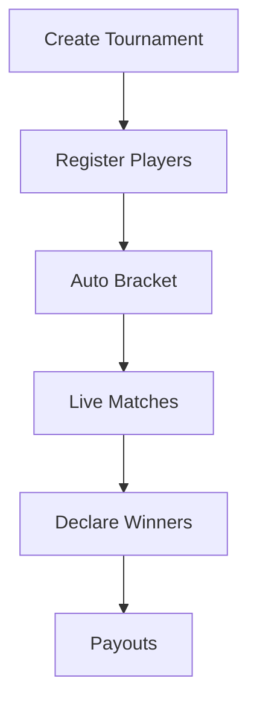

## Overview

Wamba delivers immersive online gaming experiences through its real-time multiplayer platform and esports infrastructure. You create tournaments, compete in live matches, track rankings, and build communities effortlessly. Core features include seamless multiplayer gameplay, automated tournament management, dynamic leaderboards, social tools, and integrated chat.

<Columns cols={3}>
  <Card title="Real-time Multiplayer" icon="zap" href="#real-time-multiplayer">
    Join instant matches with sub-`50ms` latency.
  </Card>
  <Card title="Esports Tournaments" icon="trophy" href="#esports-tournaments">
    Host and manage professional competitions.
  </Card>
  <Card title="Leaderboards" icon="trending-up" href="#leaderboards">
    Track global and regional rankings.
  </Card>
  <Card title="Social Tools" icon="users" href="#social-tools">
    Share highlights and form teams.
  </Card>
  <Card title="In-platform Chat" icon="message-circle" href="#chat">
    Communicate during live games.
  </Card>
</Columns>

## Real-time Multiplayer Gameplay

Engage players in synchronized sessions across devices. Wamba uses WebSockets for bidirectional communication, ensuring actions like movement or attacks update instantly for all participants.

Connect to a game session with this example:

<CodeGroup tabs="JavaScript,Python">
  ```javascript
  const ws = new WebSocket('wss://api.wamba.com/ws/game/{gameId}?token=YOUR_TOKEN');
  ws.onopen = () => console.log('Connected to multiplayer session');
  ws.onmessage = (event) => {
    const data = JSON.parse(event.data);
    updateGameState(data);
  };
  ```
  ```python
  import websocket
  import json

  ws = websocket.WebSocket()
  ws.connect('wss://api.wamba.com/ws/game/{gameId}?token=YOUR_TOKEN')
  print('Connected to multiplayer session')
  ```
</CodeGroup>

<Callout kind="tip">
  Pass `{gameId}` from the `/games/join` API endpoint to start sessions.
</Callout>

## Esports Tournament System

Build and run tournaments with automatic bracketing, seeding, and payouts. You define rules, entry fees, and prize pools via the dashboard.



<Steps>
  <Step title="Create Tournament" icon="plus">
    Use the dashboard at `https://dashboard.wamba.com/tournaments/new`.
  </Step>
  <Step title="Set Rules" icon="settings">
    Configure format, max players (`<64`), and buy-in.
  </Step>
  <Step title="Start Competition" icon="play">
    Launch and monitor progress in real-time.
  </Step>
</Steps>

## Leaderboards and Rankings

View dynamic rankings updated every `5s`. Filter by game mode, region, or time period (daily, weekly, all-time).

| Rank | Player | Score | Region |
|------|--------|-------|--------|
| 1    | ProGamerX | 12500 | NA     |
| 2    | ShadowBlade | 11850 | EU     |
| 3    | QuickScope | 11200 | APAC   |

Embed leaderboards in your app:

```javascript
fetch('https://api.wamba.com/leaderboards/global?limit=10')
  .then(res => res.json())
  .then(data => renderLeaderboard(data));
```

## Social Interaction Tools

Foster community with friend lists, team invites, and highlight sharing. Players follow rivals and collaborate on squads.

<Tabs>
  <Tab title="Add Friend" icon="user-plus">
    Send invites via player ID.
  </Tab>
  <Tab title="Share Highlight" icon="share-2">
    Upload clips to the feed.
  </Tab>
</Tabs>

## In-platform Chat and Community Features

Integrated voice and text chat powers team coordination and spectator banter. Moderation tools prevent toxicity.

<Expandable title="Advanced Chat API" default-open="false">
  Use the chat endpoint for custom integrations:

  <ParamField path="channel" param-type="string" required="true">
    Chat channel ID.
  </ParamField>

  ```javascript
  const response = await fetch('https://api.wamba.com/chat/{channel}/messages', {
    headers: { Authorization: `Bearer YOUR_TOKEN` }
  });
  ```
</Expandable>

These features combine to create competitive, social gaming environments. Start building with [Quickstart](/quickstart).